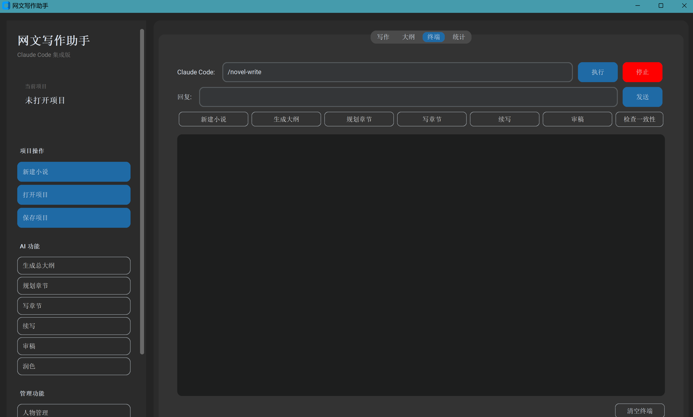
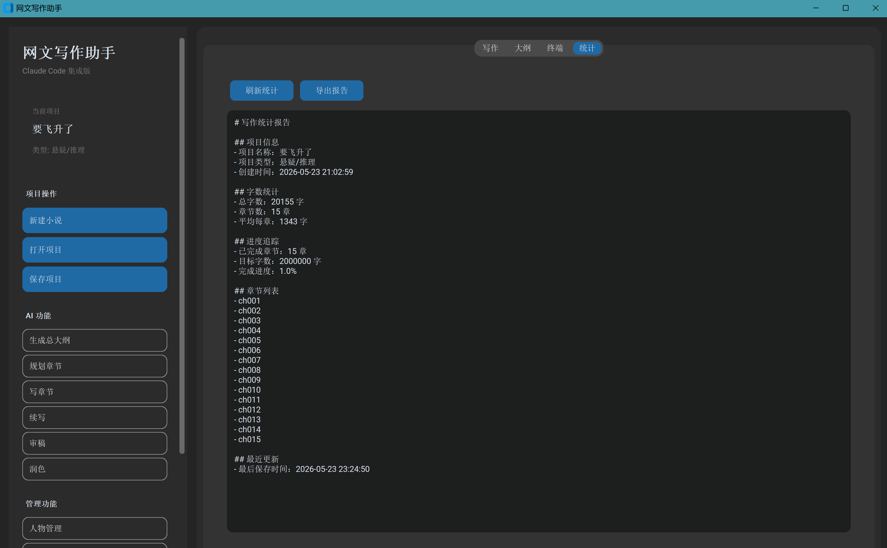
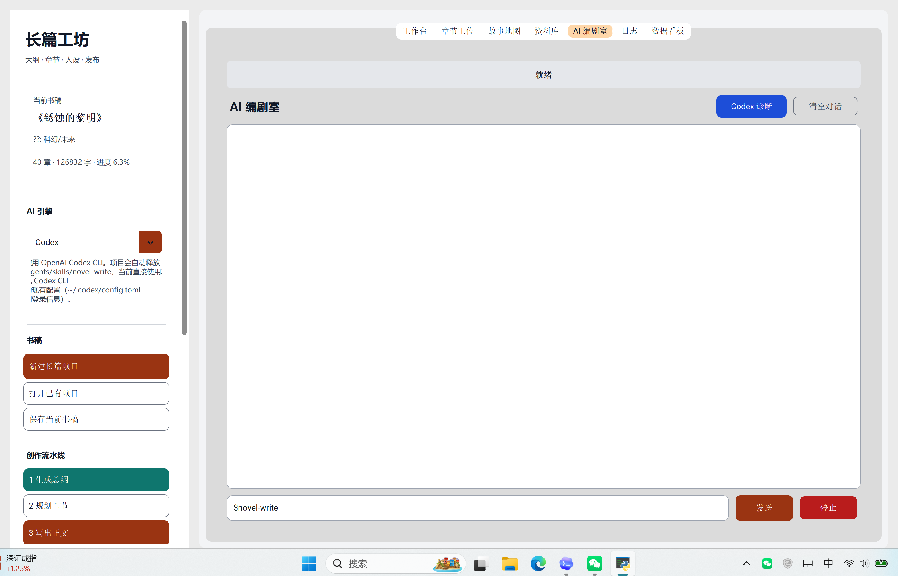

# 网文写作助手

## 项目介绍

网文写作助手是一款基于 **Claude Code Skill** 的智能小说创作工具，专为网络文学作者打造。

本项目核心是 `/novel-write` 这一自定义 Skill，封装了大纲生成、章节撰写、人物管理、世界观设定、风格控制等专业写作模块。在此基础上，项目将 Skill 与 **customtkinter GUI 界面** 深度集成，用户可通过图形界面一键调用 AI 能力，无需手动输入命令。

### 技术架构

```
┌─────────────────────────────────────────────┐
│           网文写作助手 GUI                   │
│         (customtkinter 界面)                │
├─────────────────────────────────────────────┤
│            /novel-write Skill               │
│    ┌─────┬─────┬─────┬─────┬─────┐         │
│    │大纲 │章节 │人物 │世界 │风格 │         │
│    │生成 │撰写 │管理 │设定 │控制 │         │
│    └─────┴─────┴─────┴─────┴─────┘         │
├─────────────────────────────────────────────┤
│           Claude Code CLI + LLM             │
└─────────────────────────────────────────────┘
```

### 核心优势

- **Skill 驱动** — `/novel-write` Skill 模块化设计，功能内聚，易于扩展
- **GUI 集成** — 图形界面封装 Skill 调用，降低使用门槛
- **专业流程** — 遵循网文创作最佳实践，从大纲到成稿一条龙
- **多类型支持** — 覆盖玄幻、都市、科幻、历史、悬疑、言情六大类型
- **平台适配** — 支持番茄、起点、晋江等主流平台风格

无论你是新手作者还是资深写手，这款助手都能帮助你：
- 快速构建世界观和故事框架
- 保持人物设定和情节的一致性
- 按照目标平台风格规范输出
- 高效完成长篇连载的日常更新

## 原创性声明

本项目为原创开发作品，核心代码、界面设计、功能架构均由开发者独立完成。项目中使用的 AI 能力基于 Claude Code 及其支持的大语言模型，不涉及任何第三方破解或逆向工程。

本项目仅供学习和个人创作使用，请勿用于商业用途或非法传播。如需商业合作，请联系开发者获取授权。

QQ：1943477162
邮箱：z2960775@gmail.com ；zfc200116@163.com

---

## 界面演示







---

## 下载安装

### 方式一：下载 EXE（推荐）

前往 [Releases](https://github.com/ShmilyWithme/Shmily_novel_skill/releases) 页面下载最新版本的 `网文写作助手.exe`，双击即可运行，无需安装 Python。

### 方式二：从源码运行

```bash
git clone https://github.com/ShmilyWithme/Shmily_novel_skill.git
cd Shmily_novel_skill
pip install -r requirements.txt
python novel_writer_gui.py
```

---

## 功能特性

- **大纲生成** — 总大纲、卷大纲、章节梗概，三层细化
- **章节撰写** — 3000-5000 字/章，自动遵循文风设定
- **人物管理** — 角色设定卡、一致性检查、关系追踪
- **世界观设定** — 力量体系、地理环境、社会结构
- **风格控制** — 支持起点、番茄、晋江等平台风格
- **审稿润色** — 五维评分、文字打磨、查重
- **导出发布** — 合并章节、去除元数据、一键导出

## 支持的小说类型

| 类型 | 模板 |
|------|------|
| 玄幻/仙侠 | 修仙体系、升级流、爽文 |
| 都市/现实 | 商战职场、都市异能、重生 |
| 科幻/未来 | 星际、赛博朋克、末日 |
| 历史/架空 | 宫斗、权谋、战争 |
| 悬疑/推理 | 本格推理、社会派、密室 |
| 言情/耽美 | 甜宠、虐心、先婚后爱 |

## 安装要求

### EXE 版本（推荐）

- [Claude Code CLI](https://docs.anthropic.com/claude-code)（必须）
- 无需安装 Python，开箱即用

### 源码版本

- Python 3.8+
- Claude Code CLI
- 需安装依赖：`pip install -r requirements.txt`

## 快速开始

### 方式一：下载 EXE（推荐）

1. 前往 [Releases](https://github.com/ShmilyWithme/Shmily_novel_skill/releases) 页面下载 `网文写作助手.exe`
2. 双击运行，程序会自动在当前目录创建 Skill 配置文件
3. 开始创作！

**特性：**
- 单文件运行，无需安装
- 自带 Skill 配置，无需手动配置
- 首次运行自动初始化

### 方式二：从源码运行

```bash
git clone https://github.com/ShmilyWithme/Shmily_novel_skill.git
cd Shmily_novel_skill
pip install -r requirements.txt
python novel_writer_gui.py
```

## 使用说明

### GUI 操作

1. **新建小说** — 填写项目名称、类型、平台等配置
2. **生成大纲** — 点击"生成总大纲"，AI 自动生成故事框架
3. **撰写章节** — 选择章节，点击"写章节"或在终端输入命令
4. **导出小说** — 点击"导出小说"，合并所有章节为可发布文件

### 命令行操作

| 命令 | 功能 |
|------|------|
| `新建小说` | 创建项目结构 |
| `生成总大纲` | 生成故事总大纲 |
| `生成第N卷大纲` | 生成卷级大纲 |
| `规划第N章` | 生成章节梗概 |
| `写第N章` | 撰写章节正文 |
| `继续写` | 续写当前章节 |
| `改写第N章` | 按指定方向重写 |
| `审稿` | 审阅最近章节 |
| `润色` | 文字打磨 |
| `导出` | 合并导出全文 |

## 打包成 EXE

如需将程序打包成独立的 exe 文件：

```bash
# 安装 PyInstaller
pip install pyinstaller

# 一键打包（Windows）
双击 build.bat

# 或手动打包（包含 Skill 文件）
pyinstaller --onefile --windowed --name "网文写作助手" \
    --add-data ".claude;.claude/" \
    novel_writer_gui.py
```

打包完成后，exe 文件在 `dist/` 目录中。

**注意：** 打包时会自动包含 `.claude` 目录中的 Skill 文件，确保用户下载后可直接使用。

详细打包说明见 [BUILD_README.md](BUILD_README.md)

## 项目结构

```
novel_write/
├── novel_writer_gui.py          # GUI 主程序
├── build.bat                    # 打包脚本
├── BUILD_README.md              # 打包详细说明
├── README.md                    # 项目说明
├── .claude/
│   └── skills/
│       └── novel-write/
│           ├── SKILL.md         # Skill 入口
│           └── modules/         # 功能模块
├── templates/                   # 写作模板
│   ├── genre-templates/         # 类型模板
│   ├── character-card-template.md
│   ├── worldbuilding-template.md
│   ├── outline-template.md
│   ├── chapter-template.md
│   └── style-guide.md
└── dist/
    └── 网文写作助手.exe         # 打包后的程序
```

## 自定义

### 添加新类型模板

在 `templates/genre-templates/` 下创建新的 `.md` 文件，参考现有模板格式。

### 修改文风参数

编辑项目的 `style/style-config.md` 文件，调整句式偏好、描写密度等参数。

### 添加功能模块

在 `.claude/skills/novel-write/modules/` 下创建新模块，然后在 `SKILL.md` 中注册。

## License

[MIT](LICENSE)
